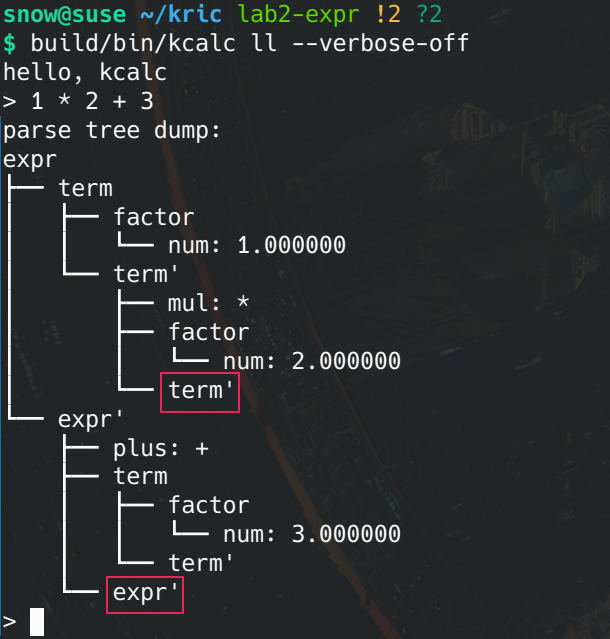
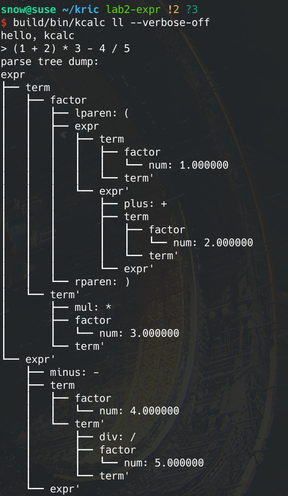
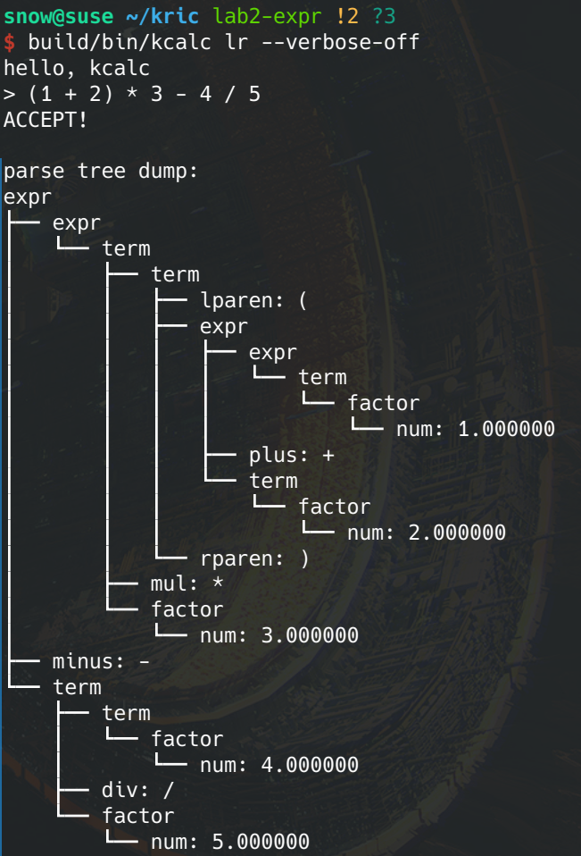
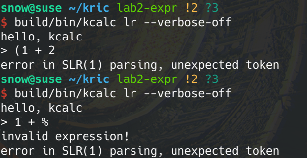

# Lab2: 语法分析

| 学号     | 姓名   |
| -------- | ------ |
| 19335109 | 李雪堃 |

[toc]

## (一) 实验环境

- openSUSE Tumbleweed
- gcc (SUSE Linux) 11.2.1 20220420 [revision 691af15031e00227ba6d5935c1d737026cda4129]
- GNU Make 4.3 Built for x86_64-suse-linux-gnu

## (二) 实验内容

本次实验我实现了算术表达式的 LL(1) 分析器和 SLR(1) 分析器。算术表达式支持加减乘除和括号运算符。

项目结构：

```
.
├── build
│   ├── bin
│   └── obj
├── include
├── src
├── Makefile
└── report.pdf
```

- 可执行文件在 `build/bin` 目录下，名为 `kcalc`。
- 编译中间文件 `*.o` 和 `*.d` 在 `build/obj` 下。
- 头文件 `*.h` 在 `include` 下，源文件 `*.c` 在 `src` 下。

构建项目：

```shell
make build && make	
# you must run "make build" for the first time, which is not needed afterwards
```

```shell
make clean
# clean all the immediate files generated like *.o and *.d, also the executable
```

<div style="page-break-after: always;"></div>

### (1) LL(1) 分析器

LL(1) 分析需要消除左递归、提取左公因子，LL(1) 分析使用的文法 (用 BNF 表示)：

```
 (1)  <expr>   ::= <term> <expr'>
 (2)  <expr'>  ::= "+" <term> <expr'>
 (3)             | "-" <term> <expr'>
 (4)             | ""
 (5)  <term>   ::= <factor> <term'>
 (6)  <term'>  ::= "*" <factor> <term'>
 (7)             | "/" <factor> <term'>
 (8)             | ""
 (9)  <factor> ::= "(" <expr> ")"
(10)             | "num"
```

其中 num 代表任意的数字，包括整数和小数。

根据上面的文法，构造出 LL(1) 分析表，其中表项 (i) 对应的是产生式的编号 (i)：

| first  |      follow      | nullable | nonterminal |  +   |  -   |  *   |  /   |  (   |  )   | num  |  $   |
| :----: | :--------------: | :------: | :---------: | :--: | :--: | :--: | :--: | :--: | :--: | :--: | :--: |
| (, num |       $, )       |  false   |    expr     |      |      |      |      | (1)  |      | (1)  |      |
|  +, -  |       $, )       |   true   |    expr'    | (2)  | (3)  |      |      |      | (4)  |      | (4)  |
| (, id  |    +, -, $, )    |  false   |    term     |      |      |      |      | (5)  |      | (5)  |      |
|  *, /  |    +, -, $, )    |   true   |    term'    | (8)  | (8)  | (6)  | (7)  |      | (8)  |      | (8)  |
| (, id  | *, /, +, -, $, ) |  false   |   factor    |      |      |      |      | (9)  |      | (10) |      |

<div style="page-break-after: always;"></div>

以算术表达式 1 * 2 + 3 为例，LL(1) 分析器的分析过程为：

| stack  | input       | action                        |
| ------ | ----------- | ----------------------------- |
| \$ expr | 1 * 2 + 3 \$      |initial state|
| \$ expr' term | 1 * 2 + 3 \$ | use (1) <expr> ::= <term> <expr'> |
| \$ expr' term' factor | 1 * 2 + 3 \$ | use (5) <term> ::= <factor> <term'> |
| \$ expr' term' num | 1 * 2 + 3 \$ | use (10) <factor> ::= "num" |
| \$ expr' term' | * 2 + 3 \$ | match 1 |
| \$ expr' term' factor * | * 2 + 3 \$ | use (6) <term'>  ::= "*" <factor> <term'> |
| \$ expr' term' factor | 2 + 3 \$ | match * |
| \$ expr' term' num | 2 + 3 \$ | use (10) <factor> ::= "num" |
| \$ expr' term' | + 3 \$ | match 2 |
| \$ expr' | + 3 \$ | use (8) <term'> ::= "" |
| \$ expr' term + | + 3 \$ | use (2) <expr'>  ::= "+" <term> <expr'> |
| \$ expr' term | 3 \$ | match + |
| \$ expr' term' factor | 3 \$ | use (5) <term> ::= <factor> <term'> |
| \$ expr' term' num | 3 \$ | use (10) <factor> ::= "num" |
| \$ expr' term' | \$ | match 3 |
| \$ expr' | \$ | use (8) <term'> ::= "" |
| \$ | \$ | use (4) expr' ::= "" |
| \$ | \$ | accept |

### (2) SLR(1) 分析器

<div style="page-break-after: always;"></div>

SLR(1) 分析器使用的文法 (用 BNF 表示)：

```
(1) <expr>   ::= <expr> "+" <term>
(2)            | <expr> "-" <term>
(3)            | <term>
(4) <term>   ::= <term> "*" <factor>
(5)            | <term> "/" <factor>
(6)            | <factor>
(7) <factor> ::= "(" <expr> ")"
(8)            | "num"
```

如果构造此文法的 LR(0) 分析器，会产生冲突，但是 SLR(1) 则不会，所以我选择实现 SLR(1) 分析器。

根据上面的文法，构造出 SLR(1) 分析表：

- si 代表 shift，并将状态 i push 到栈中
- ri 代表应用 (i) 产生式进行归约
- ji 代表跳转到状态 i，即将状态 i push 到栈中
- acc 代表接受，分析结束

| state |  +   |  -   |  *   |  /   |  (   |  )   | num  |  $   | expr | term | factor |
| :---: | :--: | :--: | :--: | :--: | :--: | :--: | :--: | :--: | :--: | :--: | :----: |
|   0   |      |      |      |      |  s4  |      |  s5  |      |  j1  |  j2  |   j3   |
|   1   |  s6  |  s7  |      |      |      |      |      | acc  |      |      |        |
|   2   |  r3  |  r3  |  s8  |  s9  |      |  r3  |      |  r3  |      |      |        |
|   3   |  r6  |  r6  |  r6  |  r6  |      |  r6  |      |  r6  |      |      |        |
|   4   |      |      |      |      |  s4  |      |  s5  |      | j10  |  j2  |   j3   |
|   5   |  r8  |  r8  |  r8  |  r8  |      |  r8  |      |  r8  |      |      |        |
|   6   |      |      |      |      |  s4  |      |  s5  |      |      | j11  |   j3   |
|   7   |      |      |      |      |  s4  |      |  s5  |      |      | j12  |   j3   |
|   8   |      |      |      |      |  s4  |      |  s5  |      |      |      |  j13   |
|   9   |      |      |      |      |  s4  |      |  s5  |      |      |      |  j14   |
|  10   |  s6  |  s7  |      |      |      | s15  |      |      |      |      |        |
|  11   |  r1  |  r1  |  s8  |  s9  |      |  r1  |      |  r1  |      |      |        |
|  12   |  r2  |  r2  |  s8  |  s9  |      |  r2  |      |  r2  |      |      |        |
|  13   |  r4  |  r4  |  r4  |  r4  |      |  r4  |      |  r4  |      |      |        |
|  14   |  r5  |  r5  |  r5  |  r5  |      |  r5  |      |  r5  |      |      |        |
|  15   |  r7  |  r7  |  r7  |  r7  |      |  r7  |      |  r7  |      |      |        |

<div style="page-break-after: always;"></div>

以算术表达式 1 * 2 + 3 为例，SLR(1) 分析器的分析过程为：

- symbol stack 用于记录归约的过程，我在代码中使用这个 stack 来辅助构造 parse tree。

| state stack | symbol stack    | input       | action                                                       |
| ----------- | --------------- | ----------- | ------------------------------------------------------------ |
| 0           | \$               | 1 * 2 + 3 \$ | s5: shift, go to state 5                                     |
| 0 5         | \$ 1             | * 2 + 3 \$   | r8: reduce by <factor> ::= "num" <br/>j3: jump to state 3    |
| 0 3         | \$ factor        | * 2 + 3 \$   | r6: reduce by <term> ::= <factor> <br/>j2: jump to state 2   |
| 0 2         | \$ term          | * 2 + 3 \$   | s8: shift, go to state 8                                     |
| 0 2 8       | \$ term *        | 2 + 3 \$     | s5: shift, go to state 5                                     |
| 0 2 8 5     | \$ term * 2      | + 3 \$       | r8: reduce by <factor> ::= "num" <br/>j13:  jump to state 13 |
| 0 2 8 13    | \$ term * factor | + 3 \$       | r4: reduce by <term> ::= <term> "*" <factor> <br/>j2: jump to state 2 |
| 0 2         | \$ term          | + 3 \$       | r3: reduce by  <expr> ::= <term> <br/>j1: jump to state 1    |
| 0 1         | \$ expr          | + 3 \$       | s6: shift, go to state 6                                     |
| 0 1 6       | \$ expr +        | 3 \$         | s5: shift, go to state 5                                     |
| 0 1 6 5     | \$ expr + 3      | \$           | r8: reduce by <factor> ::= "num" <br/>j3: jump to state 3    |
| 0 1 6 3     | \$ expr + factor | \$           | r6: reduce by <term> ::= <factor> <br/>j11: jump to state 11 |
| 0 1 6 11    | \$ expr + term   | \$           | r1: reduce by <expr> ::= <expr> "+" <term> <br/>j1: jump to state 1 |
| 0 1         | \$ expr          | \$           | acc                                                          |

<div style="page-break-after: always;"></div>

### (3) 数据结构设计

我选择用 C 语言实现 (because nothing better than C)

首先需要实现一个栈数据结构，代码在 `include/stack.h` 和 `src/stack.c`，为了让我们的栈能适用于不同的数据类型，使用 `void *` 作为参数传递的方式，变量的生命周期由使用者确定，栈只会做内存的拷贝，栈的内部并不知道数据类型，初始化时需要使用者指定元素的大小 `element_size` 和栈的容量 `capacity`，采用 `uint8_t *` 来实现字节级别的内存访问。 

```C
typedef struct stack_t
{
  uint8_t *bottom;
  uint8_t *top;
  size_t element_size;
  size_t capacity;
  size_t size;
} stack_t;
```

语法分析树的节点结构 `node_t` 包含节点类型 `node_type`、一个孩子节点指针数组 `children`、孩子数量 `child_num`。特别地，如果节点类型是数值型，`val` 将存储这个数值。

```C
typedef struct node_t
{
  node_type type;
  struct node_t **children;
  int child_num;
  long double val;
} node_t;
```

LL(1) 分析的实现主要为 `src/parser.c` 中的 `ll1_parsing()` 函数，该函数接收 lexer 输出的 token 链表 `token_list`，返回构造出的分析树的根节点指针。SLR(1) 分析的实现主要为 `slr1_parsing()` 函数，它的参数与 `ll1_parsing()` 相同。

分析表我选择用 `switch ... case ...` 的方式来实现。SLR(1) 的分析表在 `src/parser.c` 的 `action_table()`、 `goto_table()` 函数中。而 LL(1) 的分析表实际上就是 `ll1_parsing()` 中的分析过程。

<div style="page-break-after: always;"></div>

## (四) 实验结果

lab2 的 github 仓库地址: https://github.com/lixk28/kric/tree/lab2-expr

lab2 的提交历史：https://github.com/lixk28/kric/commits/lab2-expr

- 如果不包括 merge 后的提交历史，lab2 的第一次提交在 https://github.com/lixk28/kric/commit/6cf2d61af5ae54ebd4f0a3ec82bac44f227948dd

编译构建后会在 `build/bin` 目录下生成名为 `kcalc` 的可执行文件，可选两个命令行参数：

- `<parsing_method>`: `ll` or `lr`，选择使用 LL(1) 还是 SLR(1) 进行分析。
- `<verbose>`: `--verbose-on` or `--verbose-off`，指定是否输出分析的具体过程 (分析中每一步栈的内容)。

运行程序后，有解释器风格 prompt `>` 提示输入算术表达式。

clang 提供 `-ast-dump` 的可选参数，以深度优先方式输出程序的抽象语法树；另外，大多数 linux 发行版都预安装了 `tree` 命令，用于显示一个目录下的文件和子目录结构，同样也是深度优先遍历。所以，我模仿了 `tree` 命令输出的格式，将分析器返回的语法树可视化。这部分的实现为 `src/parser.c` 中的 `dump_parse_tree()` 和 `dump_node()` 函数。

每次输入算术表达式后，都会输出对应的 parse tree。

下面只展示 `--verbose-off` 的输出结果。以表达式 1 * 2 + 3 为例。

|                           LL(1)                            |                           SLR(1)                            |
| :--------------------------------------------------------: | :---------------------------------------------------------: |
|  |  |

注意到，对于 epsilon 产生式，并不会特别输出一个 "epsilon" 节点，上面 LL(1) 中的红色框出的非终结符节点表明它的子节点是 epsilon。如果有叶节点是非终结符，那么说明它对应一个 epsilon 产生式。

跟我们前面手工对 1 * 2 + 3 的 LL(1) 和 SLR(1) 分析结果对比，结果都是正确的。

<div style="page-break-after: always;"></div>

再来展示一个复杂一点的表达式 (1 + 2) * 3 - 4 / 5。分析树 "显然" 都是正确的。

|                            LL(1)                             |                            SLR(1)                            |
| :----------------------------------------------------------: | :----------------------------------------------------------: |
|  |  |

如果输入一些不合法的表达式，分析器会报错并退出。

|                        LL(1)                         |                        SLR(1)                         |
| :--------------------------------------------------: | :---------------------------------------------------: |
|  |  |

对于 (1 + 2，LL(1) 分析器会报错说终结符不匹配，这里就是指没有找到与左括号匹配的右括号。对于 1 + %，会报错说是不合法的表达式，有非法的 token，这里指的就是 %。

注意到，有些表达式 SLR(1) 不能 parse，但 LL(1) 可以 parse，反过来也是这样。LL(1) 属于 LR(1)，但是并不属于 SLR(1)，LL(1) 和 SLR(1) 只有一定的交集。 

## (五) 实验总结

这次实验手写实现了算术表达式的 LL(1) 和 SLR(1) 分析器，没有做 LR(0) 的是因为 LR(0) 的分析表有冲突、而且 LR(0) 基本上不会在实践中使用，实际上使用最多的 LR 分析法应该是 LALR(1)，拥有比 LR(1) 小的分析表。

虽然我觉得学 parsing algorithm 应该要写的是 LL/LR parser generator，工程中基本不会手写 LR parser，LL 还是有可能的，手写 LR parser 比较反直觉，且非常难维护，当要添加 feature 或 debug 时会非常痛苦。据我所知，有些语法定义得比较好的语言比如 lua 是使用 generator 生成 LALR(1) parser 来 parse 的，而一些语言比如 C++ 不能被 LL(k) 或 LR(k) parse，gcc 和 clang 都是手写的递归下降 parser，比较好维护、扩展，而且对于很多要求只要一些 hacking 就行了，考虑到工程和语言的需求，C++ standard 更新速度这么快、语法如此多且复杂，手写前端确实是唯一的选择。

总归来说，本次实验让我对 LL/LR parse table 和 parsing algorithm 加深了记忆和理解，还是很有收获的。虽然有些代码实现得比较丑陋、非常折磨，但我已经尽可能代码复用了（
