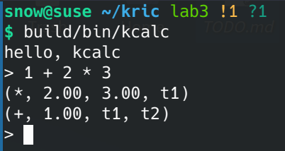
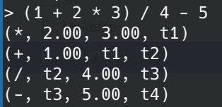
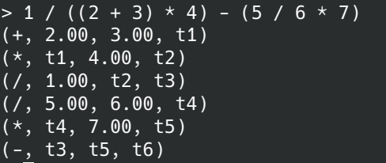
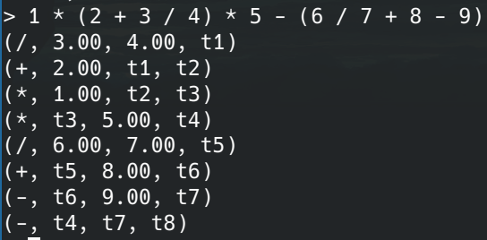

# Lab3: 语义分析

| 学号     | 姓名   |
| -------- | ------ |
| 19335109 | 李雪堃 |

[toc]

---

## (一) 实验环境

- OpenSUSE Tumbleweed
- gcc (SUSE Linux) 12.1.0
- GNU Make 4.3 Built for x86_64-suse-linux-gnu

如果需要编译项目，在项目根目录下输入：

```shell
make clean && make
```

名为 `kcalc` 的可执行文件会生成在 `build/bin` 目录下。运行时，输入：

```shell
build/bin/kcalc
```

会有解释器风格的 `>` prompt 提示输入算术表达式。每次输入一个算术表达式都会输出对应的四元式。

## (二) 实验内容

这次实验我选择实现 LL(1) 的四元式翻译，支持 `(`、`)`、`+`、`-`、`*`、`/` 的算术表达式。

带四元式翻译的算术表达式的 EBNF 如下：

```
(1)  <expr>   ::= <term> <expr'>
(2)  <expr'>  ::= "+" <term> <GEQ(+)> <expr'>
(3)             | "-" <term> <GEQ(-)> <expr'>
(4)             | ""
(5)  <term>   ::= <factor> <term'>
(6)  <term'>  ::= "*" <factor> <GEQ(*)> <term'>
(7)             | "/" <factor> <GEQ(/)> <term'>
(8)             | ""
(9)  <factor> ::= "(" <expr> ")"
(10)            | "num" <PUSH(i)>
```

其中，`GEQ()` 表示生成四元式，`PUSH()` 表示将语义符号压入语义栈中。

LL(1) 分析表如下：

| first  |      follow      | nullable | nonterminal |  +   |  -   |  *   |  /   |  (   |  )   | num  |  $   |
| :----: | :--------------: | :------: | :---------: | :--: | :--: | :--: | :--: | :--: | :--: | :--: | :--: |
| (, num |       $, )       |  false   |    expr     |      |      |      |      | (1)  |      | (1)  |      |
|  +, -  |       $, )       |   true   |    expr'    | (2)  | (3)  |      |      |      | (4)  |      | (4)  |
| (, id  |    +, -, $, )    |  false   |    term     |      |      |      |      | (5)  |      | (5)  |      |
|  *, /  |    +, -, $, )    |   true   |    term'    | (8)  | (8)  | (6)  | (7)  |      | (8)  |      | (8)  |
| (, id  | *, /, +, -, $, ) |  false   |   factor    |      |      |      |      | (9)  |      | (10) |      |

对于算术表达式 `1 + 2 * 3`，翻译过程如下：

| Node Stack | Input       | Action | Sem Stack | Quadruples |
| ---------- | ----------- | ------ | --------- | ---------- |
| \$ <expr> | 1 + 2 * 3 \$ | use (1) |            ||
| \$ <expr'> <term> | 1 + 2 * 3 \$ | use (5) | ||
| \$ <expr'> <term'> <factor> | 1 + 2 * 3 \$ | use (10) | ||
| \$ <expr'> <term'> <PUSH(1)> 1 | 1 + 2 * 3 \$ | match 1 | ||
| \$ <expr'> <term'> <PUSH(1)> | + 2 * 3 \$ | do PUSH(1) | 1 ||
| \$ <expr'> <term'> | + 2 * 3 \$ | use (8) | 1 ||
| \$ <expr'> | + 2 * 3 \$ | use (2) | 1 ||
| $ <expr'> <GEQ(+)> <term> + | + 2 * 3 \$ | match + | 1 ||
| $ <expr'> <GEQ(+)> <term> | 2 * 3 \$ | use (5) | 1 ||
| $ <expr'> <GEQ(+)> <term'> <factor> | 2 * 3 \$ | use (10) | 1 ||
| $ <expr'> <GEQ(+)> <term'> <PUSH(2)> 2 | 2 * 3 \$ | match 2 | 1 ||
| $ <expr'> <GEQ(+)> <term'> <PUSH(2)> | * 3 \$ | do PUSH(2) | 1 2 ||
| $ <expr'> <GEQ(+)> <term'> | * 3 \$ | use (6) | 1 2 ||
| \$ <expr'> <GEQ(+)> <term'> <GEQ(\*)> <factor> \* | * 3 \$ | match \* | 1 2 ||
| \$ <expr'> <GEQ(+)> <term'> <GEQ(\*)> <factor> | 3 \$ | use (10) | 1 2 ||
| \$ <expr'> <GEQ(+)> <term'> <GEQ(\*)> <PUSH(3)> 3 | 3 \$ | match 3 | 1 2 ||
| \$ <expr'> <GEQ(+)> <term'> <GEQ(\*)> <PUSH(3)> | \$ | do PUSH(3) | 1 2 3 ||
| \$ <expr'> <GEQ(+)> <term'> <GEQ(\*)> | \$ | do GEQ(\*) | 1 |(1) (*, 2, 3, t1)|
| \$ <expr'> <GEQ(+)> <term'> | \$ | use (8) | 1 t1 ||
| \$ <expr'> <GEQ(+)> | \$ | do GEQ(+) |  |(2) (+, 1, t1, t2)|
| \$ <expr'> | \$ | use (4) |  ||
| \$ | \$ | accept |  ||

在 `include/parser.h` 中，定义语义符号的结构体。`istemp` 标识是否是语义分析中的临时变量，`t` 则记录了临时变量的编号。`val` 记录符号的值，如果该语义符号不是临时变量的话。

```C
typedef struct sem_t
{
  bool istemp;
  size_t t;
  long double val;
} sem_t;
```

其次，将一些表示生成四元式的动作函数加入到 `node_type` 类型中。

```C
typedef enum node_type
{
  ND_EXPR, ND_EXPR_PRIME,
  ND_TERM, ND_TERM_PRIME,
  ND_FACTOR,

  ND_PLUS,
  ND_MINUS,
  ND_MUL,
  ND_DIV,
  ND_LPAREN,
  ND_RPAREN,
  ND_NUM,

  // syntax-directed translation for quadruple
  ND_QUAD_PLUS,		// generate quadruples
  ND_QUAD_MINUS,
  ND_QUAD_MUL,
  ND_QUAD_DIV,
  ND_PUSH_NUM,		// push a number on the stack

  ND_EOF
} node_type;
```

输出四元式的相关函数如下。`print_sem()` 会根据语义符号的类型输出它的值或者 `tn`，其中 `n` 是临时变量的编号。`emit()` 会按照 `(op, arg1, arg2, result)` 的格式输出一个四元式。

```C
// print a semantic symbol
void print_sem(sem_t sem)
{
  if (sem.istemp == true)
    fprintf(stdout, "t%ld", sem.t);
  else
    fprintf(stdout, "%.2Lf", sem.val);
}

// emit a quadruple
static void emit(char op, sem_t arg1, sem_t arg2, sem_t res)
{
  fprintf(stdout, "(%c, ", op);
  print_sem(arg1); fprintf(stdout, ", ");
  print_sem(arg2); fprintf(stdout, ", ");
  print_sem(res);
  fprintf(stdout, ")\n");
}

```

下面的部分是在 `src/paser.c` 的 `ll1_parsing()` 函数中添加的四元式生成的逻辑。首先判断节点栈的栈顶 `top` 是否表示四元式动作函数，如果是则根据对应的函数生成四元式或其他相应动作。

```C
if (isaction(top)) // top symbol is an action
{
  sem_t arg1, arg2, res;
  if (top->type != ND_PUSH_NUM)
  {
    pop(sem_stack, &arg2);
    pop(sem_stack, &arg1);
    res.istemp = true;
    res.t = ++t;
  }

  switch (top->type)
  {
    case ND_QUAD_PLUS:
      emit('+', arg1, arg2, res);
      push(sem_stack, &res);
      break;
    case ND_QUAD_MINUS:
      emit('-', arg1, arg2, res);
      push(sem_stack, &res);
      break;
    case ND_QUAD_MUL:
      emit('*', arg1, arg2, res);
      push(sem_stack, &res);
      break;
    case ND_QUAD_DIV:
      emit('/', arg1, arg2, res);
      push(sem_stack, &res);
      break;
    case ND_PUSH_NUM:
      push(sem_stack, &(sem_t){
        .istemp = false,
        .t = 0,
        .val = top->val,
      });
      break;
  }
  pop(stack, NULL);
}
```

## (三) 实验结果

对于前面给出的示例 `1 + 2 * 3`，输出结果如下：



下面展示一些更复杂的表达式的输出结果。

- `(1 + 2 * 3) / 4 - 5`
  
- `1 / ((2 + 3) * 4) - (5 / 6 * 7)`
  
- `1 * (2 + 3 / 4) * 5 - (6 / 7 + 8 - 9)`
  

可以看到生成的结果都是正确的，符合运算的优先级和结合律。

## (四) 实验总结

这次实验在上次实验 LL(1) 分析的基础上完成了算术表达式的四元式翻译，让我对语法制导翻译和四元式翻译有了更深的掌握。