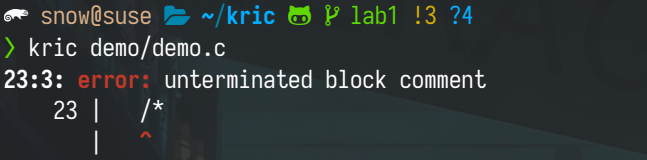
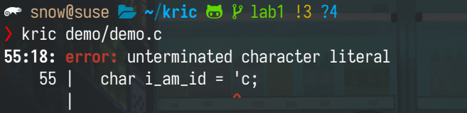
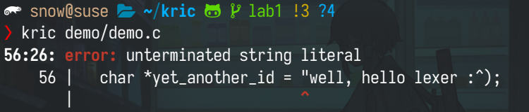

# Lab1: 词法分析

| 学号     | 姓名   |
| -------- | ------ |
| 19335109 | 李雪堃 |

[toc]

---

## (一) 实验环境

- openSUSE Tumbleweed (should also work on other linux distributions)
- gcc (SUSE Linux) 11.2.1 20220103 [revision d4a1d3c4b377f1d4acb34fe1b55b5088a3f293f6]
- GNU Make 4.3

## (二) 实验内容

### (1) 数据结构

数据结构的声明在 `include/token.h` 和 `include/lexer.h` 中。

Token 分为下面 6 种类型：

- `T_EOF`：`'\0'`
- `T_NUM`：数值类型，包括整数、浮点数
  - 具体类型是 `int`、`float` 还是 `double` 等，由 parser 确定
- `T_CHAR`：字符类型，即用单引号括起来的字符字面量
- `T_STRING`：字符串类型，即用双引号括起来的字符串字面量
- `T_ID`：标识符类型，包括变量名、函数名
  - 代表变量还是函数，由 parser 确定
- `T_KEYWORD`：关键字类型，C 保留的单词，如 `if`、`else` 等
- `T_DELIMITER`：分隔符类型，包括括号、运算符、分号、冒号、逗号等

```C
typedef enum token_type_t token_type_t;
enum token_type_t
{
  T_EOF,

  T_NUM,  // numeric literals
  T_CHAR, // character literals
  T_STR,  // string literals
  
  T_ID,         // identifiers
  T_KEYWORD,    // reserved words by C standard
  T_DELIMITER,  // everything including operators, parens, brackets, braces, commas, colons, semicolons
};
```

Token 中包含该 token 所在的位置 `loc` 和它的长度 `len`，这样就可以确定一个 token 的原始字符串。另外，还包含了该 token 的类型，我打算在 token 阶段，将字面值常量由原始字符串转换为对应的值，`T_NUM` 应转换为对应的整型值或浮点数，`T_CHAR` 转换为字符，`T_STR` 转换为字符串并在末尾自动补 `'\0'`。这个过程我觉得不应该由 parser 完成。

在我的设计中，使用一个简单的单向链表作为 lexer 输出的结果，parser 接收这个 token list，做语法分析。`next` 指向下一个 token。

```C
typedef struct token_t token_t;
struct token_t
{  
  char *loc;
  size_t len;
  token_type_t type;

  union // if type is T_NUM, it stores the value
  {
    int64_t ival;
    long double fval;
  };

  char cval;  // if type is T_CHAR_LITERAL, it stores the character
  char *sval; // if type is T_STR_LITERAL, it stores the string with null terminated

  token_t *next;  // tokens are stored as a single linked list
};
```

Lexer 中 `buf` 是读取到的源代码缓冲区，因为我目前不打算支持多个文件、超大文件的情况，所以没有保存文件路径、使用 double buffering，我计划先实现单个文件编译、链接运行时库、生成可执行代码，再考虑对多个文件的支持。指针 `p` 是 lexer 当前指向的字符，`src_size` 是源代码的大小。

```C
typedef struct lexer_t
{
  char *buf;
  char *p;
  size_t src_size;
} lexer_t;
```

### (2) 词法分析

做词法分析的代码主要在 `src/lexer.c` 的 `lex()` 函数中。

在我的实现中，我没有严格根据 DFA 进行状态转换和分词，实现的是 Hand-Coded Scanner，主要有两点原因：

- Lexer 需要有错误处理，并指出错误的地方，如果严格按照 "优雅" 的 DFA 进行分词，很难处理错误情况，并给出错误信息 (在实验结果中有说明这部分)。
- 经过调查，gcc 和 clang 的前端貌似都是 hand-coded，所以我打算采取同样的策略。

下面是在 lexer 中用到的辅助函数。

`start_with()` 判断 lexer 当前指向的位置是否与 `prefix` 匹配，比如以 `//` 或者 `/*` 开头就被识别为注释的开始。

```C
static bool start_with(char *buf, const char *prefix)
{
  return strncmp(buf, prefix, strlen(prefix)) == 0 ? true : false;
}
```

`is_keyword()` 用于进一步判断标识符是否是关键字，这里将 token 与 keyword list 中的关键字逐一匹配。

```C
static bool is_keyword(token_t *token)
{
  // ENHANCE:
  // * support more keywords :^)
  static char *keyword_list[] =
  {
    "if", "else", "do", "while", "goto", "continue", "break", "for",
    "switch", "case", "default", "return", "void", "struct", "enum",
    "singed", "unsigned", "short", "int", "long", "char", "float", "double",
    "const", "typedef", "sizeof", "typeof"
  };

  for (size_t i = 0; i < sizeof(keyword_list) / sizeof(*keyword_list); i++)
  {
    if (strlen(keyword_list[i]) == token->len && \
        !memcmp(keyword_list[i], token->loc, strlen(keyword_list[i])))
      return true;
  }
  return false;
}
```

`is_delimiter()` 用于判断 lexer 当前指向的位置是否是分隔符。我们首先判断是否与多个字符的分隔符匹配，再判断是否与单个字符的分隔符匹配，因为有些单个字符的分隔符是多个字符的前缀，先匹配多个字符的就不会出问题，注意到多个字符的分隔符中并没有谁是谁的前缀，所以我将它们放到一起。

`is_delimiter()` 会返回匹配到的分隔符的长度，用于生成 token。

```C
static int is_delimiter(char *p)
{
  // delimiters with one character
  static char delimiters_1[] =
  {
    '(', ')', '[', ']', '{', '}', ':', ';', ',', '.',
    '?', '!', '<', '>', '=',
    '+', '-', '*', '/', '%',
    '~', '&', '|'
  };

  // delimiters with multiple characters
  static char *delimiters_2[] =
  {
    "==", "!=", "<=", ">=", "->",
    "+=", "-=", "*=", "/=", "%=",
    "&&", "||",
    "++", "--",
    "&=", "|=", "^=", "<<", ">>", "<<=", ">>="
  };

  for (size_t i = 0; i < sizeof(delimiters_2) / sizeof(*delimiters_2); i++)
    if (start_with(p, delimiters_2[i]))
      return strlen(delimiters_2[i]);

  for (size_t i = 0; i < sizeof(delimiters_1) / sizeof(*delimiters_1); i++)
    if (*p == delimiters_1[i])
      return 1;
  return 0;
}
```

下面是 `lex()` 函数，其中 `NEXT_CHAR`、`NEXT_NCHAR`、`PEEK_CHAR` 是我定义的函数宏，在 `include/lexer.h` 中。`NEXT_CHAR` 会让 lexer 的当前指针 p 前进一个字符，`NEXT_NCHAR` 会让 p 前进 n 个字符，`PEEK_CHAR` 选择 p + offset 位置的字符。

首先跳过所有的空格、换行等空白字符，再跳过行间注释和块注释，然后再识别字符常量、字符串常量、标识符和关键字、分隔符。关键字的确定在标识符中，如果首先被识别为标识符 token，再调用 `is_keyword()` 判断是否是关键字。

最后，返回生成的 token 链表。

```C
token_t *lex(lexer_t *lexer)
{
  token_t head = {};
  token_t *curr = &head;

  while (*(lexer->p) != '\0')
  {
    // skip whitespaces, line feeds, carraige returns, tabs
    if (*(lexer->p) == '\n' || *(lexer->p) == '\r' || *(lexer->p) == ' ' || *(lexer->p) == '\t')
    {
      NEXT_CHAR(lexer);
      continue;
    }

    if (start_with(lexer->p, "//")) // skip inline comment
    {
      NEXT_NCHAR(lexer, 2);
      while (*(lexer->p) != '\n')
        NEXT_CHAR(lexer);
      continue;
    }

    if (start_with(lexer->p, "/*")) // skip block comment
    {
      char *q = strstr(lexer->p + 2, "*/");
      if (!q) // unclosed block comment
      {
        error_at(lexer->buf, lexer->p, "unterminated block comment");
      }
      lexer->p = q + 2;
      continue;
    }

    // numeric literals
    // ENHANCE:
    // read and convert binary, octal and hexadecimal number
    // currently we only read and convert decimal number
    // FIXME:
    // floating number format check
    if (isdigit(CURR_CHAR(lexer)) || (CURR_CHAR(lexer) == '.' && isdigit(PEEK_CHAR(lexer, 1))))
    {
      char *q = NEXT_CHAR(lexer);
      loop
      {
        if (CURR_CHAR(lexer) && PEEK_CHAR(lexer, 1) && \
            strchr("eE", CURR_CHAR(lexer)) && strchr("+-", PEEK_CHAR(lexer, 1)))
          NEXT_NCHAR(lexer, 2);
        else if (isalnum(CURR_CHAR(lexer)) || CURR_CHAR(lexer) == '.')
          NEXT_CHAR(lexer);
        else
          break;
      }
      curr->next = make_token(q, lexer->p - 1, T_NUM);
      curr = curr->next;
      continue;
    }

    // character literal
    if (CURR_CHAR(lexer) == '\'')
    {
      if (PEEK_CHAR(lexer, 1) == '\0') // unclosed char literal
      {
        error_at(lexer->buf, lexer->p, "unterminated character literal");
      }

      // ENHANCE:
      // escape character and utf-8 support
      char c = PEEK_CHAR(lexer, 1);

      char *q = strchr(lexer->p + 1, '\'');
      if (!q) // unclosed char literal
      {
        error_at(lexer->buf, lexer->p, "unterminated character literal");
      }

      curr->next = make_token(lexer->p, q, T_CHAR);
      curr->next->cval = c;
      curr = curr->next;
      NEXT_NCHAR(lexer, curr->len);
      continue;
    }

    // string literal
    if (CURR_CHAR(lexer) == '"')
    {
      if (PEEK_CHAR(lexer, 1) == '\0')  // unclosed string literal
      {
        error_at(lexer->buf, lexer->p, "unterminated string literal");
      }

      // ENHANCE:
      // * escape character and utf-8 support
      // * ignore single '\'

      char *q = strchr(lexer->p + 1, '"');
      if (!q) // unclosed string literal
      {
        error_at(lexer->buf, lexer->p, "unterminated string literal");
      }

      curr->next = make_token(lexer->p, q, T_STR);
      curr = curr->next;
      NEXT_NCHAR(lexer, curr->len);
      continue;
    }

    // identifiers or keywords
    // letter_ -> [A-Za-z_]
    // numbers -> [0-9]
    // id -> letter_ (letter_ | numbers)*
    if (isalpha(CURR_CHAR(lexer)) || CURR_CHAR(lexer) == '_')
    {
      char *q = lexer->p;
      loop
      {
        NEXT_CHAR(lexer);
        if (isalnum(CURR_CHAR(lexer)) || CURR_CHAR(lexer) == '_')
          continue;
        else
          break;
      }
      curr->next = make_token(q, lexer->p - 1, T_ID);
      if (is_keyword(curr->next))
        curr->next->type = T_KEYWORD;
      curr = curr->next;
      continue;
    }

    // delimiters
    int delim_len = is_delimiter(lexer->p);
    if (delim_len > 0)
    {
      curr->next = make_token(lexer->p, lexer->p + delim_len - 1, T_DELIMITER);
      curr = curr->next;
      NEXT_NCHAR(lexer, curr->len);
      continue;
    }

    fprintf(stderr, "oh shoot, an invalid token!\n");
    exit(1);
  }

  return head.next;
}
```

## (三) 实验结果

Lab1:

- Github 仓库地址: https://github.com/lixk28/kric/tree/lab1

- 完整提交历史: https://github.com/lixk28/kric/commits/lab1

Lab1 PPT 中给出的 demo 在 `demo/lab1_test.c` 中，我自己给出的测试 demo 在 `demo/demo.c`。`tokens.txt` 是对 `demo.c` 进行词法分析生成的结果，格式为 `token type`，每行是一个 token 和它对应的类型。由于结果太长就不贴在这里。

用于测试的 `demo.c` 的内容：

```C
// cover as many lexemes as possible

typedef enum my_enum
{
  A, B, C, D, E
} my_enum;

typedef struct my_struct
{
  int val;
  struct my_struct *next;
} my_struct;

my_struct *who_is_the_next(my_struct *a_struct)
{
  if (a_struct)
    return a_struct->next;
  return ((void*)0);  // which is NULL, because NULL is not a keyword actually
}

int main(int argc, char *argv[])
{
  /*
    this is a block comment
    I am comment :-)
  */

  // this is an inline comment

  float f1 = 3.14f;
  double f2 = 1e-5;

  int a = 2;
  int b = 1;
  int c, d;
  int _true = 1, _false = 0;

  if (_true && _false)   // and this is another inline comment
  {
    c = a + b;
    d = a * b;
  }
  else if (_true || _false)
  {
    c = a - b;
    d = a / b;
  }
  else
  {
    c = a & b;
    d = a | b;
  }

  // and this is an indentifier
  char i_am_id = 'c';
  char *yet_another_id = "well, hello lexer :^)";

  // sum of 0 to 10
  int i = 10;
  int sum = 0;
  while (i >= 0)
  {
    sum += i;
    i--;
  }

  // sum of 1 to 50
  sum = 0;
  for (int i = 1; i <= 50; i++)
  {
    sum += i;
  }

  my_struct a_struct;
  my_struct *the_next = who_is_the_next(&a_struct);
  int the_val = a_struct.val;

  return 0;
}

```

kric 支持的关键字：

```C
static char *keyword_list[] =
{
  "if", "else", "do", "while", "goto", "continue", "break", "for",
  "switch", "case", "default", "return", "void", "struct", "enum",
  "singed", "unsigned", "short", "int", "long", "char", "float", "double",
  "const", "typedef", "sizeof", "typeof"
};
```

kric 支持的分隔符：

```C
// delimiters with one character
static char delimiters_1[] =
{
  '(', ')', '[', ']', '{', '}', ':', ';', ',', '.',
  '?', '!', '<', '>', '=',
  '+', '-', '*', '/', '%',
  '~', '&', '|'
};

// delimiters with multiple characters
static char *delimiters_2[] =
{
  "==", "!=", "<=", ">=", "->",
  "+=", "-=", "*=", "/=", "%=",
  "&&", "||",
  "++", "--",
  "&=", "|=", "^=", "<<", ">>", "<<=", ">>="
};
```

kric 支持数值类型常量包括整型和浮点型，以及字符、字符串字面量。

- 数值类型的正规式 (报错处理不完善，正在开发)
  $$
  digit \rightarrow [0-9] \\
  digits \rightarrow digit \ digit^* \\
  fraction \rightarrow \ . digits \ | \ \epsilon \\
  exponent \rightarrow ((E | e) \ (+ | - | \epsilon) \ digits) \ | \ \epsilon \\
  type \rightarrow f \ | \ F \ | \ l \ | \ L | \epsilon \\
  number \rightarrow digits \ fraction \ exponent \ type
  $$
  

- 标识符类型的正规式 (报错处理打算在 parser 部分支持)
  $$
  letter\_ \rightarrow [A-Za-z\_] \\
  digit \rightarrow [0-9] \\
  id \rightarrow letter\_ \ (letter\_ \ | \ digit)^*
  $$

- 字符类型的正规式 (转义字符已支持，但未 push 到 github 仓库，由于需要改进设计)

  and other chars 指的是键盘上单个按键可以表示的字符。
  $$
  char \rightarrow [A-Za-z0-9] \ | \ and \ other \ chars
  $$

- 字符串类型的正规式 (转义字符已支持，但未 push 到 github 仓库，由于需要改进设计) 
  $$
  str \rightarrow char*
  $$

- 分隔符类型的正规式

  请查看上面 "kric 支持的分隔符"。对于分隔符，先匹配非前缀分隔符，再匹配前缀分隔符。

因为我考虑到编译器要足够聪明到发现某些问题，并提示程序员是哪个地方出错、出了什么错，如果是 DFA + 状态转换的方式，要支持这个 feature 可能非常麻烦。

所以我为了理论和工程上的 trade-off，代码并不是严格按照 DFA 或正规式来实现的，目前 lexer 的实现不完善 (==这里的不完善指的是，对于语法正确且 kric 支持的源代码，完全可以转换成对应的正确的 token list；而对于语法有错误的程序，目前的报错处理并不完善==)。

kric 目前可以在 lex 阶段，识别出某些位置的错误，发现错误 kric 会直接 exit，这不仅对用户友好，而且可以为用户节省宝贵的时间和电费，为环保作出贡献。报错信息的格式模仿的是 gcc，给出错误位置的行、列数，错误提示信息，以及出错的那一行代码。这部分的实现在 `include/error.h` 和 `src/error.c`。

目前支持的错误识别有：

- 块注释缺失 `*/` 配对

  去掉 `demo.c` 中 26 行的 `*/`，报错块注释未终止。

  

- 字符常量缺失 `'` 配对

  去掉 `demo.c` 中 55 行的末尾的 `'`，报错字符常量未终止。

  

- 字符串常量缺失 `"` 配对

  去掉 `demo.c` 中 56 行的末尾 `"`，报错字符串常量未终止。

  

## (四) 实验总结

这次实验基本完成了 lexer 的实现，但还有以下的不足和改进之处：

- 我的设计中，打算在 lex 阶段将字面量转换成对应的值并存储在 token 中，由于这一部分涉及到类型和后面的 parser 阶段 (比如字面量上 `0.4f` 是 `float`，但代码中声明为 `double`，编译器可能会 warning)，我目前的实现还有待改进，故在本地做了 commit 但没有 push 到 github 仓库中。
- 数据结构设计不完善，我写到后面发现用一个 `lexer_t` 里面存 `buf` 和 `p` 是非常愚蠢的行为，基于 KISS 的原则直接在 `lexer.c` 中声明两个 `staic` 就行了，写代码的时候每次都需要写 `lexer->p` 而不是 `p`，而且 `error_at` 需要传 `lexer->buf` 这个本可以避免的参数，我觉得非常愚蠢。说明我还没有掌握面向对象的精髓，就是不要尝试用 C 模拟面向对象 :-)

另外，关于 kric 报错部分的设计我觉得十分合理，后面应当保留并延续，user-friendly 而且 eco-friendly :^)，可以节省电费。